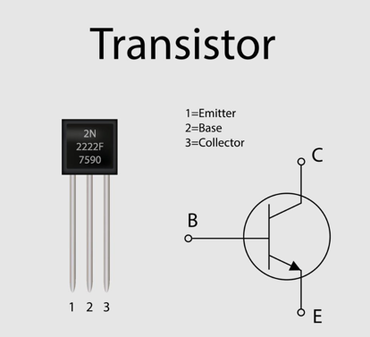

# 2 Electrical Engineering

## Transistor

- Special electrical component
- That can interrupt flow of electricity

## Types of Gates
- Wire (technically no Gate)
- Not
- And
- Or
- Xor

## "Programming"
These gates can be used to write any type of computer program.

Examples:
- Latch
- 